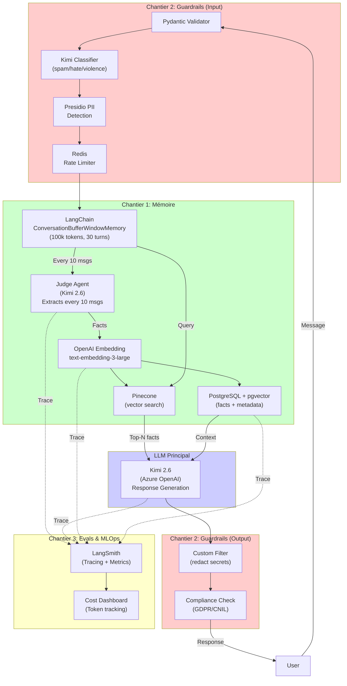
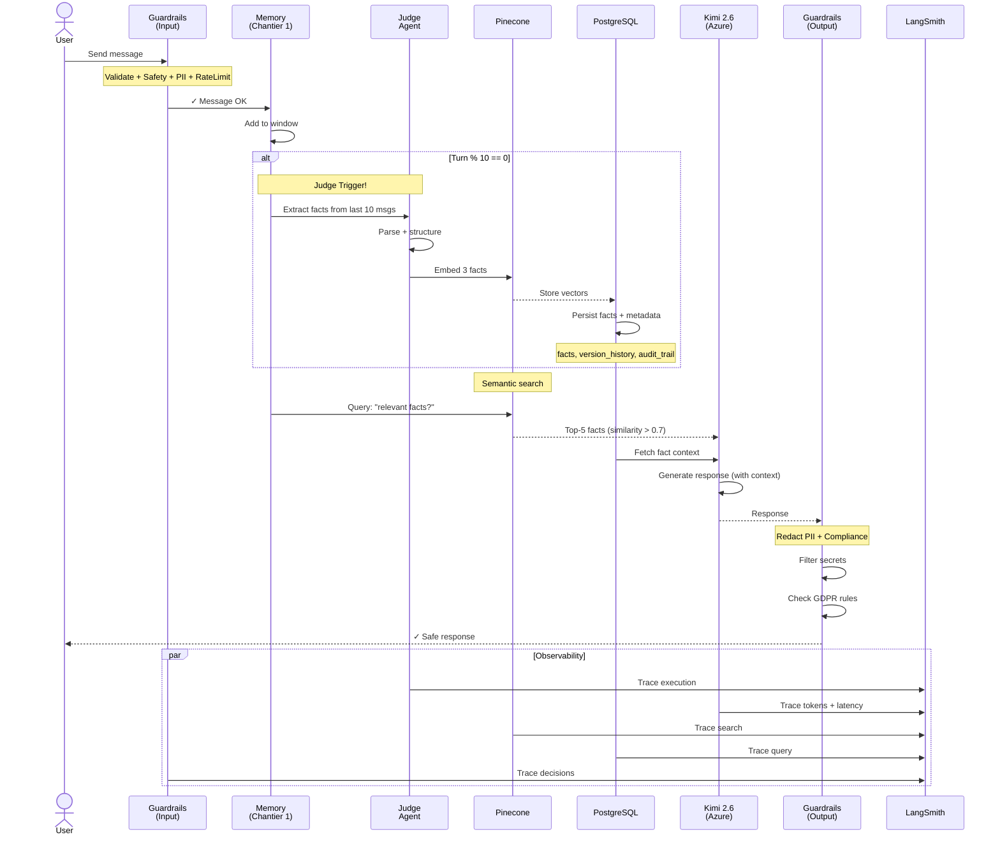
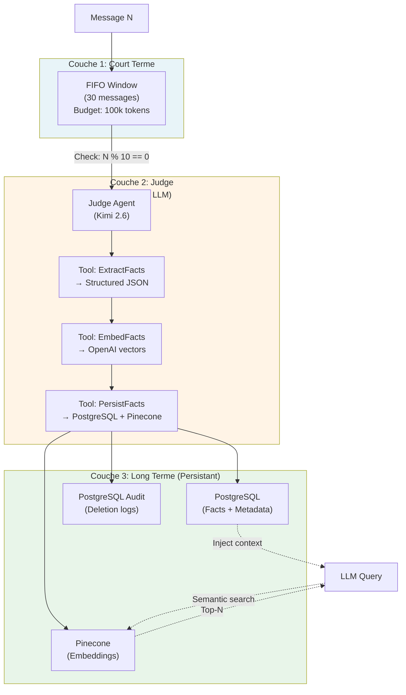
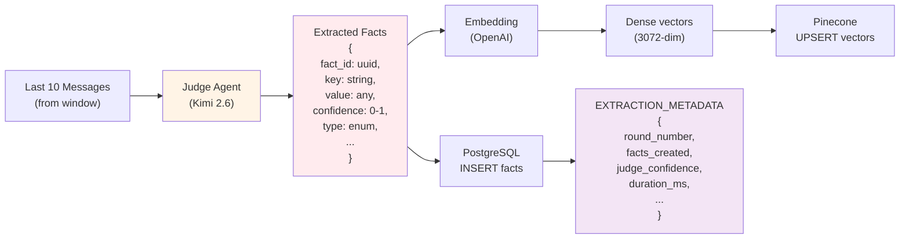
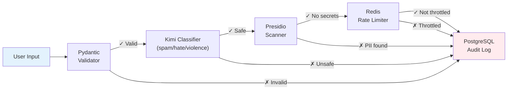
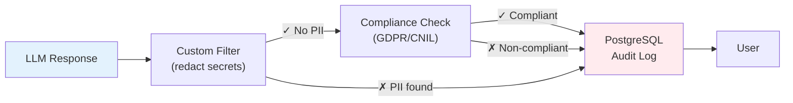
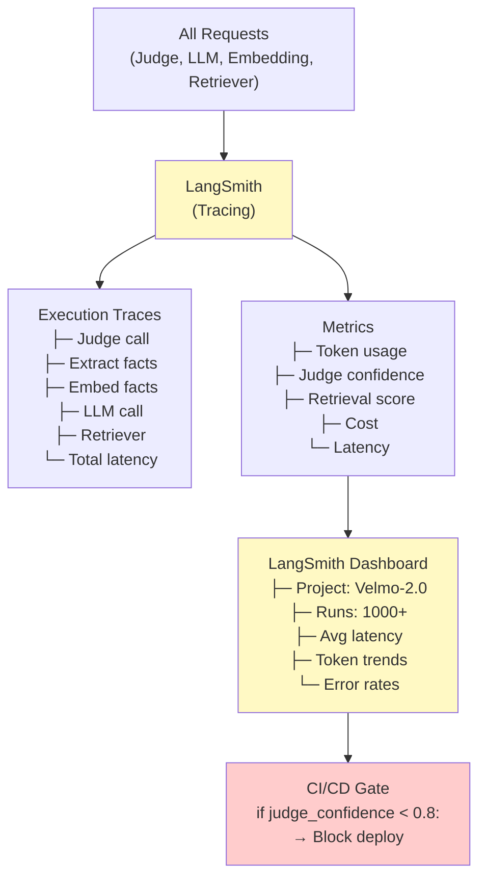
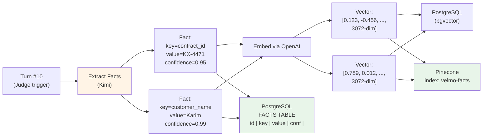
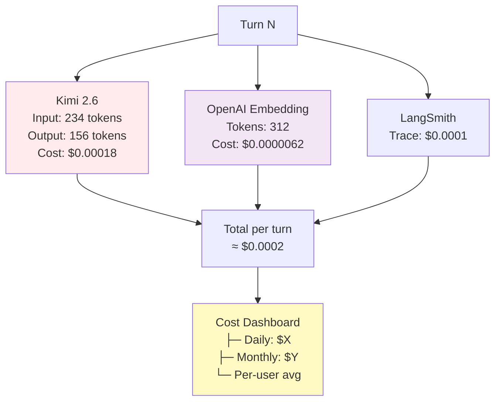
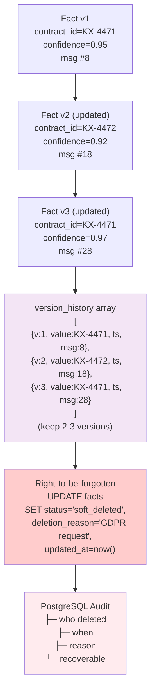

# VELMO 2.0 — Vue d'Architecture Détaillée

## 1. Architecture Globale (3 Chantiers)

---

## 2. Sequence Diagram: Turn-by-Turn Processing

---

## 3. Memory Layer Detail (Chantier 1)

---

## 4. Judge Extraction Lifecycle

---

## 5. Guardrails Pipeline (Chantier 2)

### Input Flow

### Output Flow

---

## 6. Observability: LangSmith Integration

---

## 7. Data Flow: Facts & Embeddings

---

## 8. Cost Tracking (Chantier 3)

---

## 9. Version History & Soft-Delete (GDPR)

---

## Integration Points for Code

| Layer | Code Point | LangChain Class |
|-------|-----------|-----------------|
| Input Validation | Before memory | Pydantic `BaseModel` |
| Memory Window | First step | `ConversationBufferWindowMemory` |
| Judge Trigger | Every 10 msgs | `Tool` + `AgentExecutor` |
| Embedding | Judge output | `OpenAIEmbeddings` |
| Vector Search | Before LLM | `Pinecone.as_retriever()` |
| LLM Call | Main response | `AzureChatOpenAI` |
| Output Guard | Before user | Custom function |
| Tracing | Everywhere | `LangSmithTracer` callback |

---

## Next: See Also

- [00_STACK_GLOBALE.md](./00_STACK_GLOBALE.md) — Overview + tech choices
- [02_INTEGRATION_PLAN.md](./02_INTEGRATION_PLAN.md) — Step-by-step setup
- [chantier-1-memoire/01_DESIGN.md](./chantier-1-memoire/01_DESIGN.md) — Memory design details
