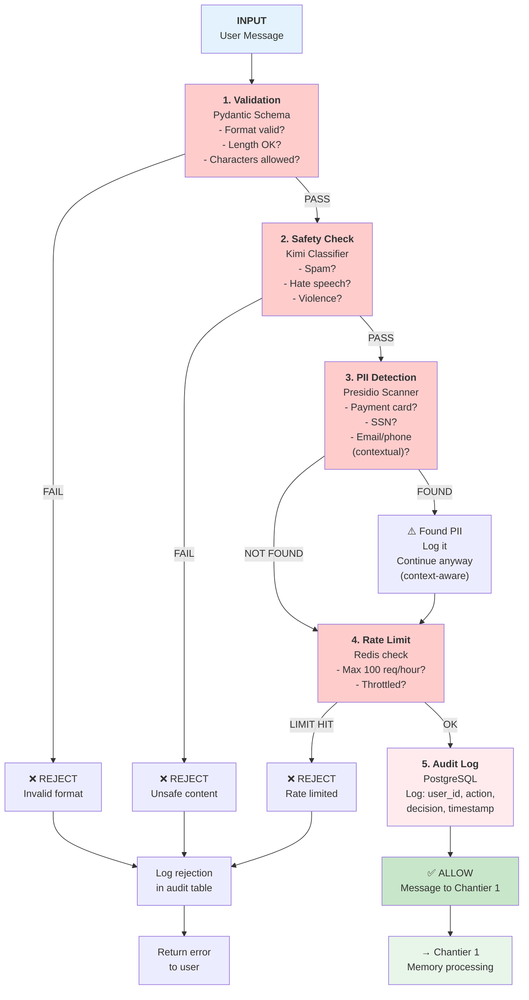
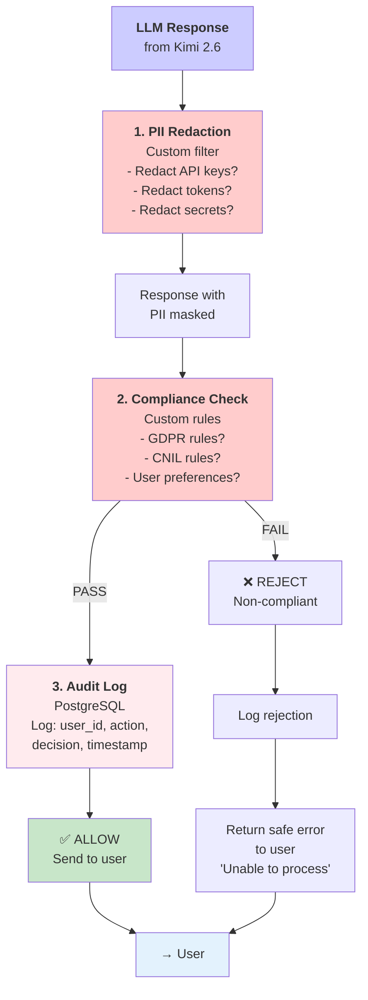
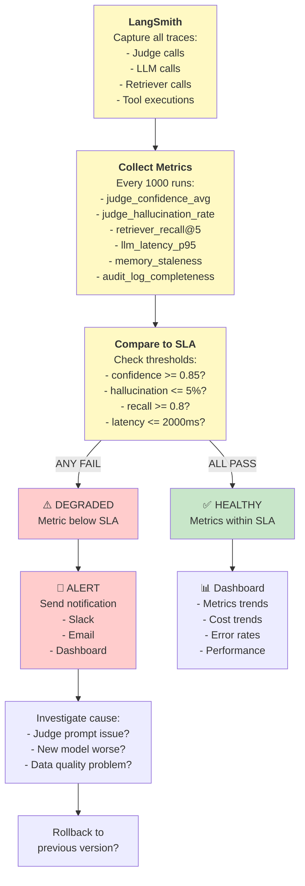
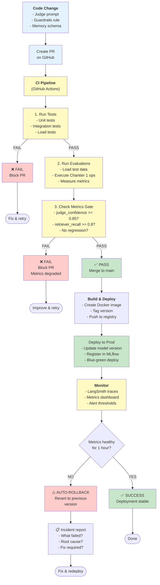
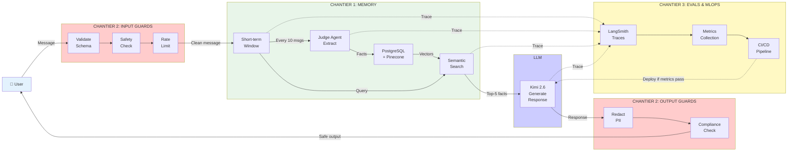
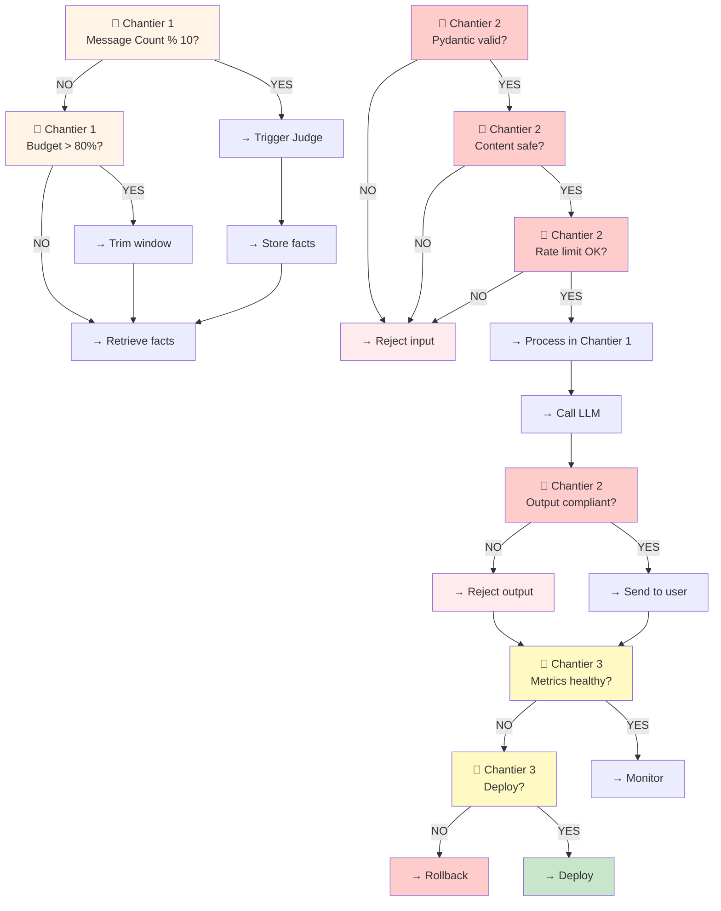

# VELMO 2.0 — Flowcharts des 3 Chantiers

---

## 1. CHANTIER 1: Mémoire (3-Layer Architecture)

```mermaid
flowchart TD
    Start([User Message Arrives]) --> AddWindow["<b>Couche 1: Short-term</b><br/>Add to LangChain Window<br/>(100k tokens FIFO)"]
    
    AddWindow --> CheckCount{"Message count<br/>% 10 == 0?"}
    
    CheckCount -->|NO| Retrieve["<b>Couche 3: Retrieval</b><br/>Query Pinecone<br/>(semantic search)<br/>Get top-5 facts"]
    
    CheckCount -->|YES| Judge["<b>Couche 2: Judge</b><br/>Extract facts from<br/>last 10 messages<br/>(Kimi 2.6)"]
    
    Judge --> Validate["Validate facts<br/>(Pydantic schema)<br/>confidence >= 0.8?"]
    
    Validate -->|INVALID| SkipPersist["Skip invalid facts<br/>Log error"]
    
    Validate -->|VALID| Embed["Embed facts<br/>(OpenAI embedding)<br/>3072-dim vectors"]
    
    Embed --> Persist["<b>Persist to Storage</b><br/>- PostgreSQL: facts<br/>- Pinecone: vectors<br/>- Audit log: metadata"]
    
    Persist --> UpdateMeta["Update extraction_metadata<br/>- round_number<br/>- facts_created<br/>- judge_confidence<br/>- duration_ms"]
    
    UpdateMeta --> Retrieve
    
    SkipPersist --> Retrieve
    
    Retrieve --> BuildContext["Build LLM context<br/>- Retrieved facts<br/>- Short-term window<br/>- User message"]
    
    BuildContext --> LLMCall["<b>LLM Principal</b><br/>Kimi 2.6<br/>Generate response<br/>(with facts context)"]
    
    LLMCall --> Response["<b>OUTPUT</b><br/>Response to user<br/>(+ add to window)"]
    
    Response --> UpdateWindow["Update window<br/>with response<br/>(check budget)"]
    
    UpdateWindow --> CheckBudget{"Budget > 80%?"}
    
    CheckBudget -->|YES| Trim["Trim oldest messages<br/>from window<br/>(facts already saved)"]
    
    CheckBudget -->|NO| Trace
    
    Trim --> Trace["<b>Observability</b><br/>LangSmith trace:<br/>- Judge confidence<br/>- Retrieval score<br/>- LLM tokens<br/>- Latency"]
    
    Trace --> End([End: Response Sent])
    
    style Start fill:#e3f2fd
    style AddWindow fill:#fff4e6
    style Judge fill:#fff4e6
    style Embed fill:#fff4e6
    style Persist fill:#e8f5e9
    style Retrieve fill:#e8f5e9
    style LLMCall fill:#ccccff
    style Response fill:#c8e6c9
    style Trace fill:#fff9c4
```

---

## 2. CHANTIER 2: Guardrails (Input/Output Protection)

### 2.A — Input Flow

### 2.B — Output Flow

---

## 3. CHANTIER 3: Evals & MLOps (Monitoring + Deployment)

### 3.A — Evaluation Loop

### 3.B — MLOps / Deployment Pipeline

---

## 4. Full End-to-End Flow (All 3 Chantiers)

---

## 5. Decision Points (Chaque Étape)

---

## Summary Table: Decision Points

| Decision | Chantier | Condition | Action If YES | Action If NO |
|----------|----------|-----------|---------------|--------------|
| Judge trigger? | 1 | message_count % 10 == 0 | Extract facts | Skip extraction |
| Budget check? | 1 | window_tokens > 80% | Trim old messages | Continue |
| Pydantic valid? | 2 (Input) | schema match | Continue | Reject input |
| Content safe? | 2 (Input) | Kimi classifier | Continue | Reject input |
| Rate limit? | 2 (Input) | req/hour < 100 | Continue | Reject input |
| PII found? | 2 (Input) | Presidio scan | Log + Continue | Continue |
| Output compliant? | 2 (Output) | GDPR rules | Send to user | Reject output |
| Metrics healthy? | 3 | avg_confidence >= 0.85 | Deploy | Investigate |
| Auto-rollback? | 3 | degradation detected | Rollback | Stay deployed |

---

## See Also

- [00_STACK_GLOBALE.md](./00_STACK_GLOBALE.md)
- [01_ARCHITECTURE_OVERVIEW.md](./01_ARCHITECTURE_OVERVIEW.md)
- [02_INTEGRATION_PLAN.md](./02_INTEGRATION_PLAN.md)
