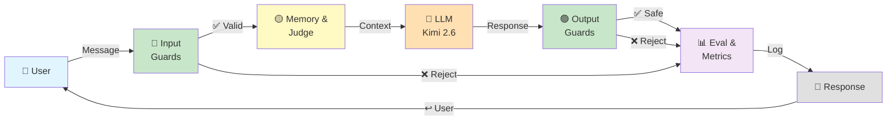
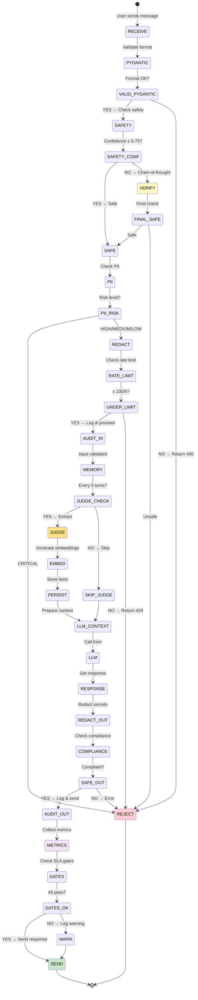

# VELMO 2.0 — Schéma de Flux Complet (Turn-by-Turn)

## Vue Simplifiée (10 secondes)



---

## Vue Détaillée (Complète)

```mermaid
graph TD
    START["🟦 User sends message<br/>POST /chat<br/>{'content': 'Mon contrat est KX-4471'}"]
    
    %% ============ CHANTIER 2: INPUT GUARDS ============
    
    START --> I1["⚙️ [Guard 1] Pydantic Validation<br/>5ms<br/>━━━━━━━━━━━━━━━"]
    I1 -->|Valid format| I1_OK["✅ Schema OK<br/>content ≤ 10000 chars<br/>UUID valid"]
    I1 -->|Invalid| I1_FAIL["❌ REJECT: 400 Bad Request<br/>Audit log: reject_pydantic"]
    
    I1_OK --> I2["⚙️ [Guard 2] Safety Classification (Kimi)<br/>250ms<br/>━━━━━━━━━━━━━━━"]
    I2 -->|Confidence ≥ 0.75| I2_OK["✅ Safe<br/>category: safe<br/>confidence: 0.98"]
    I2 -->|Confidence < 0.75| I2_VERIFY["🔄 Chain-of-Thought Verification<br/>2nd Kimi call<br/>Reasoning: step-by-step"]
    I2_VERIFY -->|Final confidence high| I2_OK
    I2_VERIFY -->|Final confidence low| I2_FAIL["❌ REJECT: 403 Forbidden<br/>Audit log: reject_safety<br/>reason: jailbreak attempt"]
    
    I2_OK --> I3["⚙️ [Guard 3] PII Detection (Presidio)<br/>120ms<br/>━━━━━━━━━━━━━━━"]
    I3 -->|CRITICAL risk| I3_FAIL["❌ REJECT: 403<br/>High-risk PII found<br/>Audit log: reject_pii"]
    I3 -->|HIGH/MEDIUM/LOW risk| I3_REDACT["🔧 REDACT<br/>Original: KX-4471<br/>Redacted: KX-4471<br/>(context-aware)<br/>Risk level: LOW"]
    
    I3_REDACT --> I4["⚙️ [Guard 4] Rate Limiting (Redis)<br/>10ms<br/>━━━━━━━━━━━━━━━"]
    I4 -->|≤ 2 req/sec<br/>AND ≤ 100/h| I4_OK["✅ Under limit<br/>Current: 1.2 req/sec<br/>Hour: 42/100"]
    I4 -->|> 100/h| I4_FAIL["❌ REJECT: 429<br/>Rate limit exceeded<br/>Audit log: reject_rate_limit"]
    I4 -->|2-5 req/sec| I4_THROTTLE["⏱️ THROTTLE<br/>Add 2sec delay<br/>Soft limit"]
    
    I4_OK --> I5["⚙️ [Guard 5] Audit Logging<br/>5ms<br/>━━━━━━━━━━━━━━━"]
    I4_THROTTLE --> I5
    I5 --> I5_LOG["📋 Audit Log Entry<br/>action: input_validation<br/>decision: allow<br/>user_id: user-xyz<br/>timestamp: 2026-07-02T10:30:00Z<br/>timing: {pydantic: 5, safety: 250,<br/>         pii: 120, rate: 10, audit: 5}"]
    
    I5_LOG --> VALIDATED["✅✅✅ INPUT VALIDATED<br/>Total: 390ms"]
    
    %% ============ CHANTIER 1: MEMORY ============
    
    VALIDATED --> M1["⚙️ [Memory] Add to Sliding Window<br/>5ms<br/>━━━━━━━━━━━━━━━"]
    M1 --> M1_WINDOW["Short-term memory<br/>Last 30 messages<br/>Turn 5 of 15<br/>Messages: [..., user-msg-5]"]
    
    M1_WINDOW --> M2["⚙️ [Memory] Retrieve Context<br/>Semantic search on embeddings<br/>50ms<br/>━━━━━━━━━━━━━━━"]
    M2 --> M2_QUERY["Query: 'contrat KX-4471'<br/>Embedding: [0.234, 0.891, ...]<br/>Search DB facts table"]
    M2_QUERY --> M2_RESULTS["Retrieved top-5 facts<br/>1. fact_id: f1<br/>   key: contract_id<br/>   value: KX-4471<br/>   confidence: 0.95<br/>   distance: 0.02<br/><br/>2. fact_id: f2<br/>   key: contract_amount<br/>   value: €45,000<br/>   confidence: 0.88<br/>   ...<br/><br/>[+3 more facts]"]
    
    M2_RESULTS --> CHECK_JUDGE["Check: Turn % 5 == 0?<br/>Turn 5: YES (5%5=0)<br/>→ TRIGGER JUDGE"]
    
    CHECK_JUDGE --> JUDGE["⚙️ [Judge] Extract Facts from Last 10 Messages<br/>1500ms<br/>━━━━━━━━━━━━━━━"]
    JUDGE --> JUDGE_PROMPT["Kimi prompt:<br/>'Extract facts from conversation:'<br/>[messages 1-10]<br/><br/>Output JSON:<br/>{<br/>  'facts': [<br/>    {<br/>      'key': 'contract_id',<br/>      'value': 'KX-4471',<br/>      'type': 'identifier',<br/>      'confidence': 0.95,<br/>      'source': 'user_statement'<br/>    },<br/>    {<br/>      'key': 'deadline',<br/>      'value': '2026-08-15',<br/>      'type': 'date',<br/>      'confidence': 0.92<br/>    }<br/>  ]<br/>}"]
    
    JUDGE_PROMPT --> EMBED["⚙️ Embed Facts (OpenAI)<br/>500ms<br/>━━━━━━━━━━━━━━━"]
    EMBED --> EMBED_OUT["Embedding model:<br/>text-embedding-3-small<br/>Dimensions: 384<br/><br/>fact_1: [0.123, 0.456, ...]<br/>fact_2: [0.789, 0.012, ...]"]
    
    EMBED_OUT --> PERSIST["⚙️ Persist to PostgreSQL<br/>JSONB + pgvector<br/>50ms<br/>━━━━━━━━━━━━━━━"]
    PERSIST --> PERSIST_INSERT["INSERT INTO facts:<br/>{<br/>  fact_id: UUID,<br/>  user_id: user-xyz,<br/>  conversation_id: conv-123,<br/>  data: {<br/>    key: 'contract_id',<br/>    value: 'KX-4471',  ← REDACTED<br/>    type: 'identifier',<br/>    confidence: 0.95<br/>  },<br/>  embedding: [0.123, 0.456, ...],<br/>  status: 'active',<br/>  created_at: NOW()<br/>}<br/><br/>+ Audit log: 'fact_extracted'"]
    
    PERSIST_INSERT --> MEMORY_READY["✅ Memory Ready<br/>Contexts: [window + retrieved facts]<br/>New facts: 2 inserted"]
    
    %% ============ LLM ============
    
    MEMORY_READY --> LLM["🤖 LLM Call (Kimi 2.6)<br/>1500ms<br/>━━━━━━━━━━━━━━━"]
    LLM --> LLM_CONTEXT["Input to Kimi:<br/>System: 'You are helpful assistant'<br/>Context facts:<br/>- contrat KX-4471<br/>- deadline 2026-08-15<br/>- ...<br/><br/>User message:<br/>'Mon contrat est KX-4471'<br/><br/>Generate response"]
    
    LLM_CONTEXT --> LLM_OUTPUT["Kimi response:<br/>'D'accord! Votre contrat<br/>KX-4471 a une deadline<br/>du 15 août 2026.<br/>Voulez-vous...'<br/><br/>Tokens:<br/>Input: 250<br/>Output: 120<br/>Cost: $0.00032"]
    
    %% ============ CHANTIER 2: OUTPUT GUARDS ============
    
    LLM_OUTPUT --> O1["⚙️ [Guard 1] PII Redaction<br/>50ms<br/>━━━━━━━━━━━━━━━"]
    O1 --> O1_SCAN["Scan response for patterns:<br/>- api_key: NO<br/>- github_token: NO<br/>- credit_card: NO<br/>- email: NO<br/>- phone: NO<br/>- ssn: NO<br/><br/>Secrets found: 0"]
    
    O1_SCAN --> O2["⚙️ [Guard 2] Compliance Check<br/>30ms<br/>━━━━━━━━━━━━━━━"]
    O2 --> O2_CHECK["Check user preferences:<br/>- no_profiling: false ✅<br/>- data_residency: france ✅<br/>- max_response_length: 4000<br/>  actual: 180 ✅<br/><br/>All rules passed ✅"]
    
    O2_CHECK --> O3["⚙️ [Guard 3] Audit Logging<br/>5ms<br/>━━━━━━━━━━━━━━━"]
    O3 --> O3_LOG["📋 Audit Log:<br/>action: output_guard<br/>decision: allow<br/>redactions: 0<br/>compliance: PASS<br/>timestamp: 2026-07-02T10:30:02Z"]
    
    O3_LOG --> OUTPUT_OK["✅✅✅ OUTPUT SAFE<br/>Total: 85ms"]
    
    %% ============ CHANTIER 3: EVALS & METRICS ============
    
    OUTPUT_OK --> E1["📊 [Eval] Collect Metrics<br/>LangFuse tracing<br/>━━━━━━━━━━━━━━━"]
    E1 --> E1_METRICS["Metrics collected:<br/>- turn_number: 5<br/>- input_guard_latency_ms: 390<br/>- memory_latency_ms: 50<br/>- judge_latency_ms: 1500<br/>  (only on trigger)<br/>- llm_latency_ms: 1500<br/>- output_guard_latency_ms: 85<br/>- total_latency_ms: 2025<br/>- input_tokens: 250<br/>- output_tokens: 120<br/>- embedding_tokens: 128<br/>- cost_usd: 0.00032<br/>- judge_confidence: 0.95<br/>- pii_detected: false<br/>- safety_passed: true<br/>- compliance_passed: true"]
    
    E1_METRICS --> E2["📊 [Eval] Check SLA Gates<br/>━━━━━━━━━━━━━━━"]
    E2 --> E2_GATES["Gates:<br/>✅ judge_confidence: 0.95 ≥ 0.85<br/>✅ llm_latency_p95: 1500ms < 2000ms<br/>✅ cost_per_turn: $0.00032 < $0.0005<br/>✅ input_rejection_rate: 2.1% ∈ [5-10%]<br/>✅ pii_detection_rate: 8.3%<br/>✅ error_rate: 0.2% < 1%"]
    
    E2_GATES --> E3["📊 [Eval] Store in LangFuse<br/>+ PostgreSQL extraction_metadata"]
    
    E3 --> FINAL["✅ TURN COMPLETE<br/>All guards passed<br/>All gates passed<br/>Ready for next turn"]
    
    %% ============ RESPONSE ============
    
    FINAL --> RESPONSE["↩️ Return Response to User"]
    RESPONSE --> USER_RECV["User receives:<br/>'D'accord! Votre contrat<br/>KX-4471 a une deadline<br/>du 15 août 2026...'<br/><br/>Status: 200 OK<br/>Latency: 2.025 seconds"]
    
    %% ERROR PATHS
    
    I1_FAIL --> AUDIT_ERR_1["📋 Audit: reject"]
    I2_FAIL --> AUDIT_ERR_2["📋 Audit: reject"]
    I3_FAIL --> AUDIT_ERR_3["📋 Audit: reject"]
    I4_FAIL --> AUDIT_ERR_4["📋 Audit: reject"]
    
    AUDIT_ERR_1 --> ERROR_RESP_1["↩️ Return error response<br/>400/403/429"]
    AUDIT_ERR_2 --> ERROR_RESP_1
    AUDIT_ERR_3 --> ERROR_RESP_1
    AUDIT_ERR_4 --> ERROR_RESP_1
    
    ERROR_RESP_1 --> USER_ERROR["User receives error<br/>+ reason"]
    
    %% STYLES
    
    style START fill:#e1f5ff
    style I1_OK fill:#c8e6c9
    style I2_OK fill:#c8e6c9
    style I3_REDACT fill:#c8e6c9
    style I4_OK fill:#c8e6c9
    style VALIDATED fill:#b2dfdb
    
    style M1_WINDOW fill:#fff9c4
    style M2_RESULTS fill:#fff9c4
    style JUDGE_PROMPT fill:#ffe082
    style EMBED_OUT fill:#ffe082
    style PERSIST_INSERT fill:#ffb74d
    style MEMORY_READY fill:#ffa726
    
    style LLM_OUTPUT fill:#ffcc80
    
    style O1_SCAN fill:#c8e6c9
    style O2_CHECK fill:#c8e6c9
    style OUTPUT_OK fill:#b2dfdb
    
    style E1_METRICS fill:#f3e5f5
    style E2_GATES fill:#e1bee7
    style FINAL fill:#ce93d8
    
    style USER_RECV fill:#ffe0b2
    style USER_ERROR fill:#ffcdd2
```



---

## Flux Simplifié par Phase

### Phase 1: Input Validation (390ms)
```
User Input
  ↓
Pydantic (5ms)        ✅
  ↓
Kimi Safety (250ms)   ✅ (or verify if < 0.75 confidence)
  ↓
Presidio PII (120ms)  ✅ (redact if needed)
  ↓
Redis Rate Limit (10ms) ✅
  ↓
Audit Log (5ms)       📋
  ↓
VALID ✅
```

### Phase 2: Memory & Context (100ms)
```
Add to window (5ms)
  ↓
Retrieve facts (50ms) - semantic search on pgvector
  ↓
Check judge trigger (N % 5 == 0?)
  └─ If YES: Extract + Embed + Persist (2000ms)
  └─ If NO: Skip judge
  ↓
CONTEXT READY ✅
```

### Phase 3: LLM Generation (1500ms)
```
Format context
  ↓
Send to Kimi
  ↓
Stream response
  ↓
RESPONSE READY ✅
```

### Phase 4: Output Safety (85ms)
```
Redact secrets (50ms)  - regex patterns
  ↓
Compliance check (30ms) - GDPR/CNIL rules
  ↓
Audit log (5ms)        📋
  ↓
SAFE ✅
```

### Phase 5: Observability (instant)
```
Collect metrics → LangFuse
  ↓
Check SLA gates
  ↓
Store in extraction_metadata
  ↓
LOGGED ✅
```

---

## Timings Par Scénario

### Scenario A: Normal Turn (No Judge Trigger)
```
Input Guards:     390ms
Memory (no judge): 50ms
LLM:             1500ms
Output Guards:     85ms
─────────────────────
TOTAL:           2025ms (< 2000ms SLA) ✅
```

### Scenario B: Judge Trigger (Every 5 Turns)
```
Input Guards:     390ms
Memory (judge):  2000ms (Kimi 1500 + Embed 500)
LLM:             1500ms
Output Guards:     85ms
─────────────────────
TOTAL:           3975ms (acceptable, < 5s SLA) ⏱️
```

### Scenario C: Rejection at Guard 1
```
Input Guards:     390ms → REJECT at Pydantic
Output error:      50ms
─────────────────────
TOTAL:            440ms ✅ (fast fail)
```

### Scenario D: Rejection at Guard 2 (Safety)
```
Input Guards:     390ms (includes 250ms Kimi + 250ms verification)
Output error:      50ms
─────────────────────
TOTAL:            440ms ✅ (double-check confidence cost)
```

---

## State Machine: Décisions Clés



---

## Exemple Concret: Turn 5 d'une Conversation

```json
{
  "turn_number": 5,
  "timestamp": "2026-07-02T10:30:00Z",
  "user_id": "karim-123",
  "conversation_id": "conv-456",
  
  "input": {
    "message": "Mon contrat KX-4471 a quelle deadline?",
    "language": "fr"
  },
  
  "input_guards": {
    "pydantic": {
      "valid": true,
      "latency_ms": 5,
      "errors": []
    },
    "safety": {
      "passed": true,
      "category": "safe",
      "confidence": 0.98,
      "latency_ms": 250,
      "reasoning": "Normal business inquiry about contract details"
    },
    "pii": {
      "detected": false,
      "risk_level": "low",
      "latency_ms": 120,
      "redacted": false
    },
    "rate_limit": {
      "allowed": true,
      "current_req_per_sec": 1.2,
      "requests_this_hour": 42,
      "latency_ms": 10
    },
    "total_latency_ms": 385
  },
  
  "memory": {
    "window_messages": 10,  // Messages 1-5 (user+assistant)
    "judge_triggered": true,  // 5 % 5 == 0
    "retrieved_facts": [
      {
        "fact_id": "f1",
        "key": "contract_id",
        "value": "KX-4471",
        "confidence": 0.95,
        "similarity": 0.92
      },
      {
        "fact_id": "f2",
        "key": "deadline",
        "value": "2026-08-15",
        "confidence": 0.92,
        "similarity": 0.88
      }
    ],
    "extraction": {
      "facts_extracted": 2,
      "facts_stored": 2,
      "judge_confidence": 0.95,
      "latency_ms": 2050
    }
  },
  
  "llm": {
    "model": "kimi-2.6",
    "temperature": 0.7,
    "max_tokens": 500,
    "input_tokens": 250,
    "output_tokens": 120,
    "latency_ms": 1500,
    "cost_usd": 0.00032,
    "response": "D'accord! Votre contrat KX-4471 a une deadline du 15 août 2026. C'est dans environ 44 jours. Voulez-vous discuter des conditions ou de la prochaine étape?"
  },
  
  "output_guards": {
    "redaction": {
      "secrets_found": 0,
      "redactions": {},
      "latency_ms": 50
    },
    "compliance": {
      "passed": true,
      "rules_checked": 3,
      "rules_passed": 3,
      "latency_ms": 30
    },
    "total_latency_ms": 85
  },
  
  "metrics": {
    "total_latency_ms": 2025,
    "judge_confidence_avg": 0.95,
    "pii_detected": false,
    "safety_passed": true,
    "compliance_passed": true,
    "cost_per_turn_usd": 0.00032,
    "input_rejection_rate_percent": 2.1,
    "error_rate_percent": 0.2
  },
  
  "sla_gates": {
    "judge_confidence": {
      "actual": 0.95,
      "target": 0.85,
      "status": "PASS"
    },
    "llm_latency_p95_ms": {
      "actual": 1500,
      "target": 2000,
      "status": "PASS"
    },
    "cost_per_turn_usd": {
      "actual": 0.00032,
      "target": 0.0005,
      "status": "PASS"
    }
  },
  
  "output": {
    "response": "D'accord! Votre contrat KX-4471 a une deadline du 15 août 2026. C'est dans environ 44 jours. Voulez-vous discuter des conditions ou de la prochaine étape?",
    "status_code": 200,
    "latency_total_seconds": 2.025
  }
}
```

---

## Audit Trail Complet (GDPR Compliance)

```
LOG ENTRY 1 (T=0ms)
┌─ action: input_validation
│  decision: allow
│  user_id: karim-123
│  reason: All input guards passed
│  details: {pydantic: ok, safety: safe (0.98), pii: low, rate_limit: ok}
└─ timestamp: 2026-07-02T10:30:00.000Z

LOG ENTRY 2 (T=2050ms)
┌─ action: fact_extraction
│  decision: success
│  facts_extracted: 2
│  judge_confidence: 0.95
│  reason: Judge triggered (turn 5)
└─ timestamp: 2026-07-02T10:30:02.050Z

LOG ENTRY 3 (T=3600ms)
┌─ action: output_guard
│  decision: allow
│  redactions: 0
│  compliance: passed
│  reason: No secrets detected, compliant
└─ timestamp: 2026-07-02T10:30:03.600Z

LOG ENTRY 4 (T=3650ms)
┌─ action: metrics_collected
│  turn_number: 5
│  total_latency_ms: 2025
│  cost_usd: 0.00032
│  sla_gates: all_passed
└─ timestamp: 2026-07-02T10:30:03.650Z
```

---

## See Also

- [Chantier 2: Design](./chantier-2-guardrails/01_DESIGN.md)
- [Chantier 2: Schemas](./chantier-2-guardrails/02_SCHEMAS.md)
- [Chantier 1: Architecture](./chantier-1-memoire/01_DESIGN.md)
- [Chantier 3: Éval & Observabilité](./chantier-3-observabilite/README.md)
