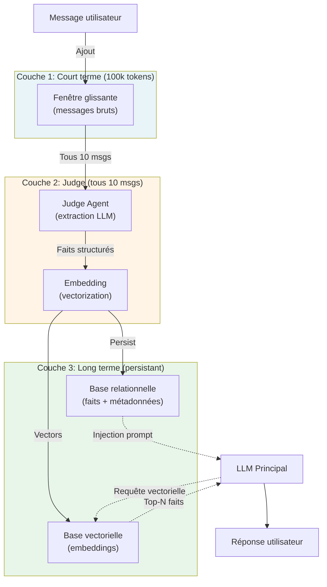
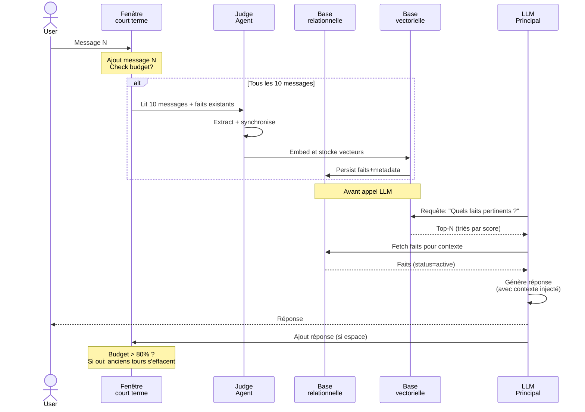
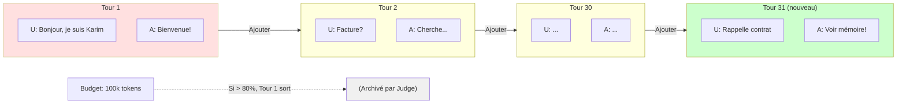
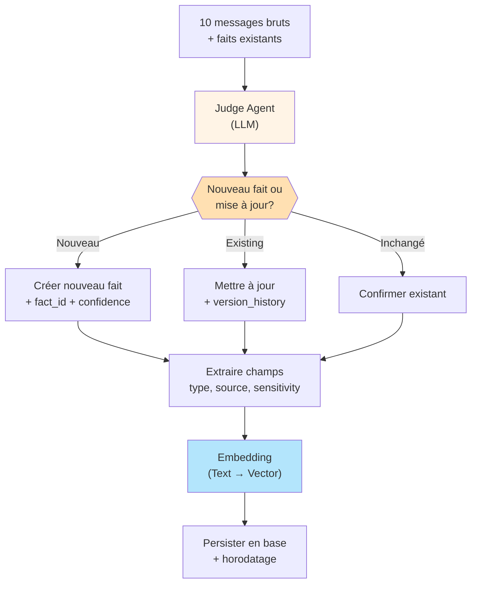
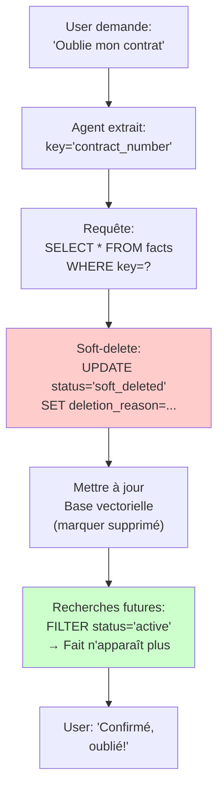
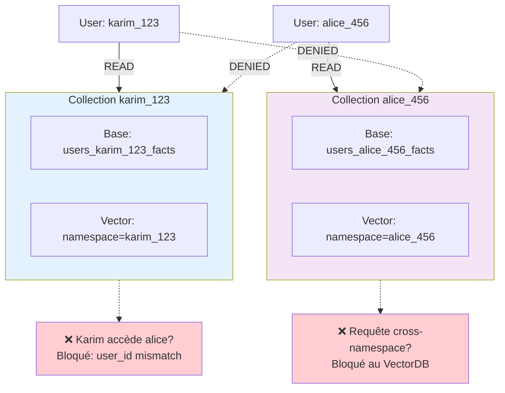
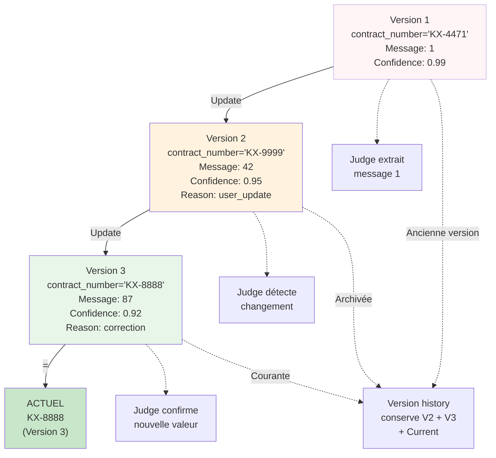
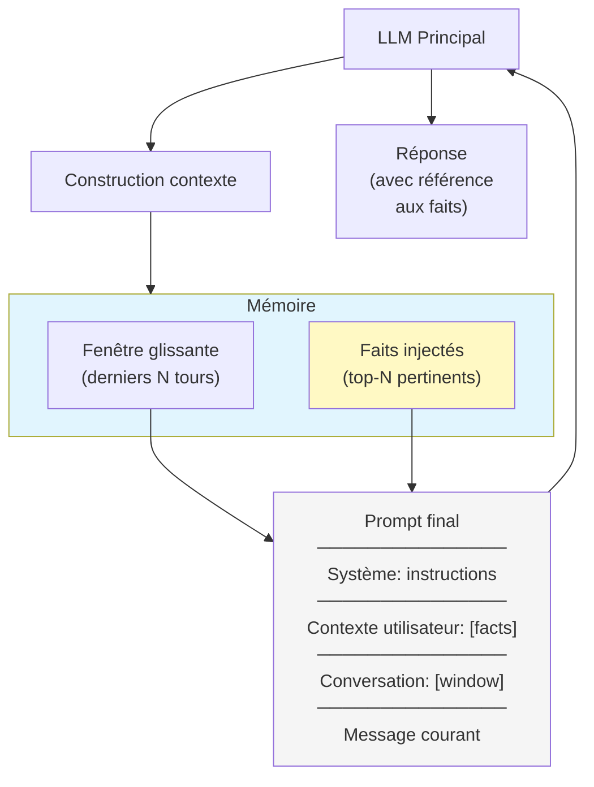
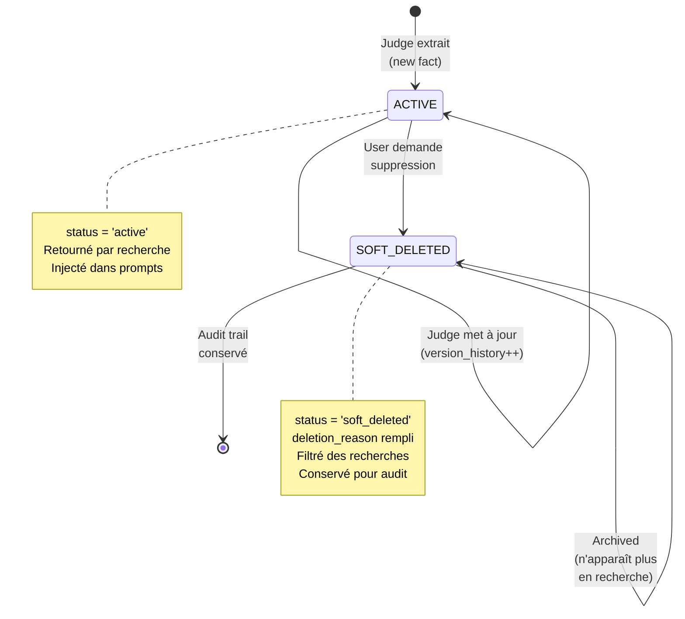

# Diagrammes — Chantier 1 : Mémoire

**Visualisations** de l'architecture et des flux du Chantier 1.

---

## Architecture — Vue d'ensemble

---

## Flux par tour (détaillé)

---

## Fenêtre glissante (FIFO)

---

## Judge — Extraction et synchronisation

---

## Recherche vectorielle (avant LLM)

```mermaid
graph LR
    Message["Message utilisateur<br/>'Rappelle mon contrat'"]
    
    Embed["Embedding<br/>(Text → Vector)"]
    
    Query["Requête vectorielle<br/>(cosine similarity)"]
    
    VecDB["Base vectorielle<br/>(user_id namespace)"]
    
    Results["Résultats triés<br/>par pertinence"]
    
    Select["Sélection Top-N<br/>(budget tokens)"]
    
    Filter["Filtre: status=active<br/>Exclus: soft_deleted"]
    
    Inject["Injection dans prompt<br/>LLM"]
    
    Message --> Embed
    Embed --> Query
    Query --> VecDB
    VecDB --> Results
    Results --> Select
    Select --> Filter
    Filter --> Inject
    
    style VecDB fill:#b3e5fc
    style Inject fill:#c8e6c9
```

---

## Droit à l'oubli (R5) — Suppression

---

## Isolation stricte (R3)

---

## Historique des versions (monitoring)

---

## Interaction mémoire ↔ LLM principal

---

## Machine à états — Cycle de vie d'un fait

---

**Diagrammes exportables** : voir `/diagrams/` pour fichiers Mermaid bruts.

**Version** : 1.0  
**Date** : 30 juin 2026
