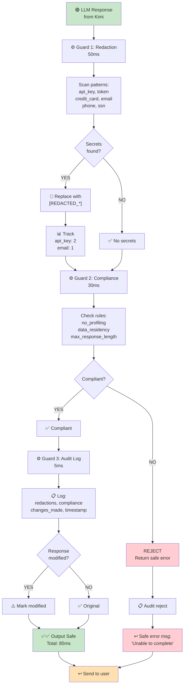
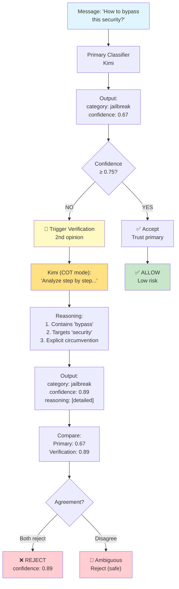
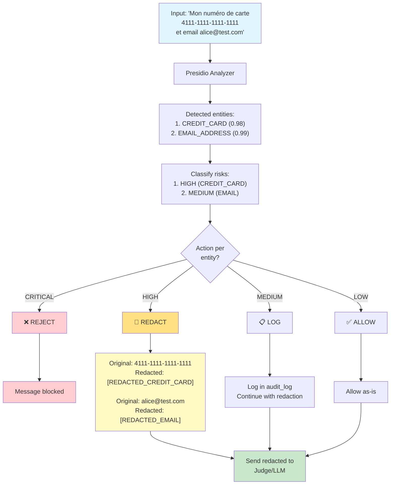
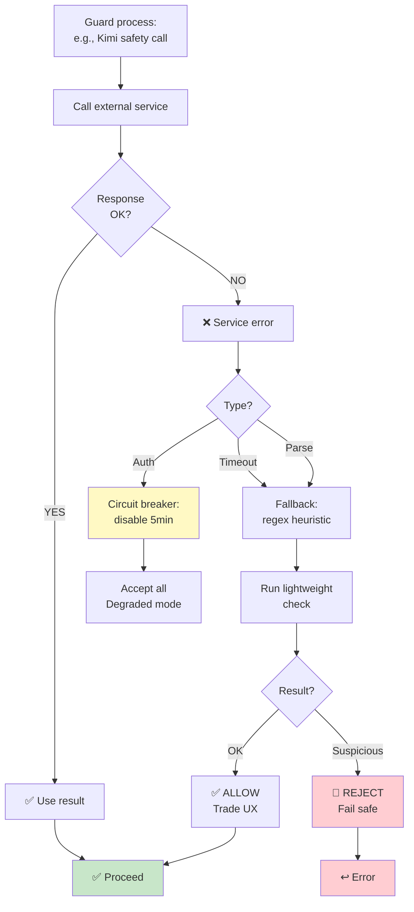
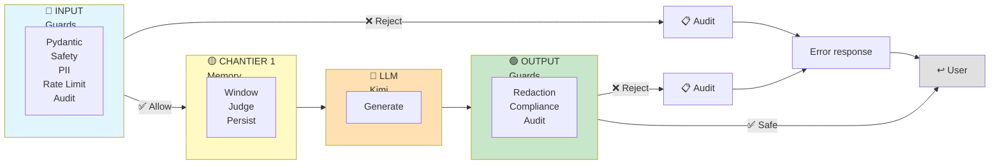
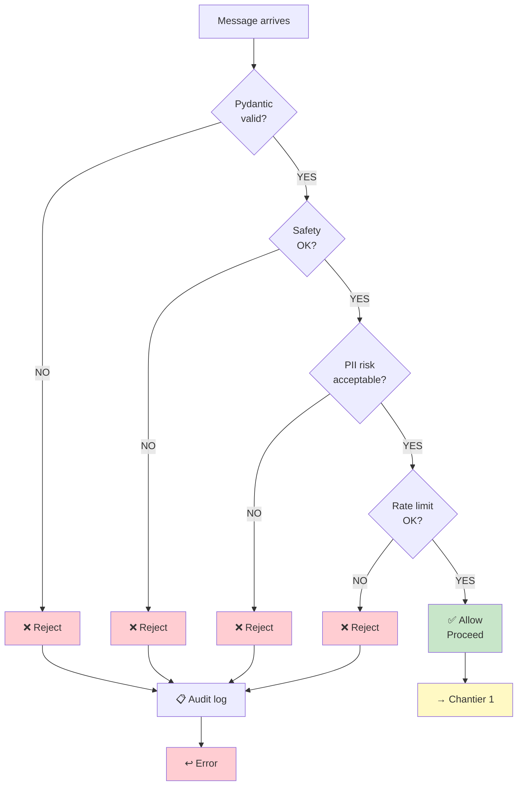
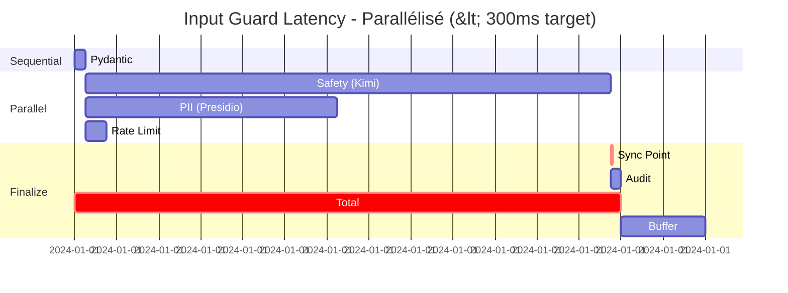
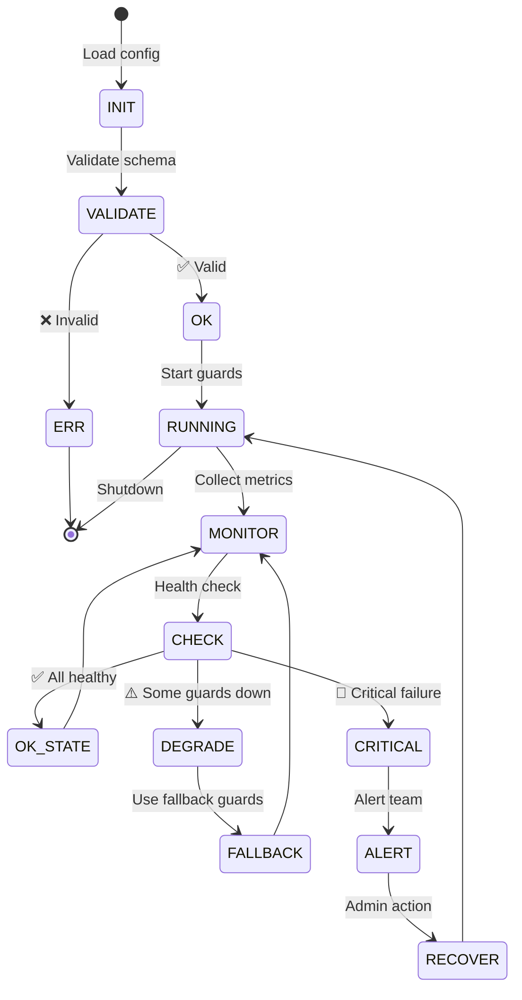
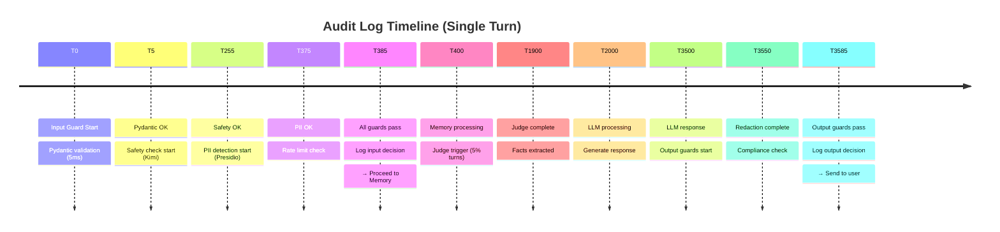

# Chantier 2: Visual Flows & Diagrams

## 1. Input Guard Pipeline (Optimisé - Parallélisé)

```mermaid
graph TD
    A["🔵 User Message Arrives"] --> B["⚙️ Guard 1: Pydantic<br/>5ms"]
    
    B -->|✅ Valid| B_OK["Format OK"]
    B -->|❌ Invalid| B_FAIL["REJECT<br/>400 Bad Request"]
    
    B_OK --> PAR["⚡ PARALLEL EXECUTION"]
    
    PAR --> C["⚙️ Guard 2: Safety (Kimi)<br/>250ms"]
    PAR --> D["⚙️ Guard 3: PII (Presidio)<br/>120ms"]
    PAR --> E["⚙️ Guard 4: Rate Limit<br/>10ms"]
    
    C --> C_CONF{Confidence<br/>≥ 0.75?}
    C_CONF -->|YES| C_OK["✅ Safe"]
    C_CONF -->|NO| C_VERIFY["🔄 COT verify<br/>+150ms"]
    C_VERIFY --> C_OK
    C_CONF -->|NO (REJECT)| C_FAIL["❌ REJECT<br/>403"]
    
    D --> D_RISK{Risk?}
    D_RISK -->|CRITICAL| D_FAIL["❌ REJECT<br/>403"]
    D_RISK -->|HIGH/MEDIUM| D_REDACT["🔧 REDACT"]
    D_RISK -->|LOW| D_OK["✅ ALLOW"]
    D_REDACT --> D_OK
    
    E --> E_CHECK{Rate?}
    E_CHECK -->|OK| E_OK["✅ NORMAL"]
    E_CHECK -->|THROTTLE| E_THROTTLE["⏱️ +2sec"]
    E_CHECK -->|EXCEED| E_FAIL["❌ REJECT<br/>429"]
    E_THROTTLE --> E_OK
    
    C_OK --> SYNC["🔄 SYNC"]
    D_OK --> SYNC
    E_OK --> SYNC
    
    SYNC --> F["⚙️ Guard 5: Audit<br/>5ms"]
    F --> FINAL["✅✅ ALLOW<br/>Total: 260ms"]
    
    B_FAIL --> AUDIT["📋 Audit"]
    C_FAIL --> AUDIT
    D_FAIL --> AUDIT
    E_FAIL --> AUDIT
    AUDIT --> ERR_RESP["↩️ Error"]
    
    FINAL --> PROCEED["→ Chantier 1<br/>Memory"]
    
    style A fill:#e1f5ff
    style PAR fill:#c8e6c9
    style FINAL fill:#c8e6c9
    style PROCEED fill:#fff9c4
    style SYNC fill:#fff9c4
    style B_FAIL fill:#ffcdd2
    style C_FAIL fill:#ffcdd2
    style D_FAIL fill:#ffcdd2
    style E_FAIL fill:#ffcdd2
    style ERR_RESP fill:#ffcdd2
```

---

## 2. Output Guard Pipeline



---

## 3. Safety Classification: Chain-of-Thought



---

## 4. PII Detection with Presidio



---

## 5. Rate Limiting: Sliding Window

```mermaid
graph LR
    T0["T=0s<br/>Req 1"]
    T0 --> C1["Count: 1<br/>Status: ✅<br/>NORMAL"]
    
    C1 --> T05["T=0.5s<br/>Req 2"]
    T05 --> C2["Count: 2<br/>Status: ✅<br/>SOFT LIMIT HIT"]
    
    C2 --> T07["T=0.7s<br/>Req 3"]
    T07 --> C3["Count: 3<br/>Status: ⏱️<br/>THROTTLE<br/>+2sec delay"]
    
    C3 --> T11["T=1.1s<br/>Req 4"]
    T11 --> C4["Count: 4<br/>Status: ⏱️<br/>THROTTLE"]
    
    C4 --> T30["T=3.0s<br/>Req 5<br/>Window reset"]
    T30 --> C5["Count: 1<br/>Status: ✅<br/>NORMAL"]
    
    C5 --> HOUR["Per-hour: 5/100<br/>Status: ✅<br/>OK"]
    
    HOUR --> T3600["T=3600s<br/>Req 100<br/>Hour window"]
    T3600 --> C100["Count: 100/100<br/>Status: ✅<br/>AT LIMIT"]
    
    C100 --> T3605["T=3605s<br/>Req 101"]
    T3605 --> C101["Count: 101/100<br/>Status: ❌<br/>HARD REJECT<br/>429 Too Many"]
    
    style C1 fill:#c8e6c9
    style C2 fill:#c8e6c9
    style C3 fill:#fff9c4
    style C4 fill:#fff9c4
    style C5 fill:#c8e6c9
    style HOUR fill:#c8e6c9
    style C100 fill:#ffe082
    style C101 fill:#ffcdd2
```



---

## 6. Error Handling: Fail Open Strategy



---

## 7. Full Input→Output Flow



---

## 8. Guard Decision Tree



---

## 9. Latency Budget (Optimisé)



---

## 10. Configuration State Machine



---

## 11. Audit Trail Timeline



---

## See Also

- [02_SCHEMAS.md](./02_SCHEMAS.md) — Pydantic models
- [01_DESIGN.md](./01_DESIGN.md) — Architecture details
- [../SCHEMA_FLUX_COMPLET.md](../SCHEMA_FLUX_COMPLET.md) — Full end-to-end flow
