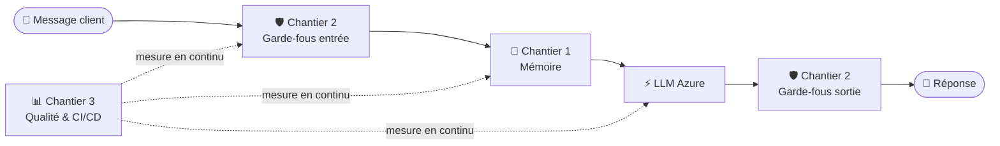

# 📖 Documentation Velmo 2.0

Bienvenue dans la documentation centrale de **Velmo 2.0**, l'agent de support client
IA (mémoire persistante + garde-fous de sécurité + boucle qualité mesurée).

> 🧭 **Par où commencer ?** Suivez le [guide de démarrage](demarrage.md) pour installer
> et lancer le projet, puis lisez [l'architecture globale](architecture.md).

## 🗺️ Sommaire

| Section | À quoi ça sert | Aller voir |
|---------|----------------|-----------|
| **🚀 Démarrage** | Installer et lancer le projet, pas à pas | [demarrage.md](demarrage.md) |
| **Architecture** | Vue d'ensemble du système + schéma du flux d'une conversation | [architecture.md](architecture.md) |
| **Chantier 1 — Mémoire** | Comment l'agent se souvient (court terme, long terme, oubli RGPD) | [chantiers/1-memoire/](chantiers/1-memoire/README.md) |
| **Chantier 2 — Garde-fous** | Comment l'agent bloque les contenus interdits (entrée + sortie) | [chantiers/2-guardrails/](chantiers/2-guardrails/README.md) |
| **Chantier 3 — Qualité & CI/CD** ⭐ | Comment on prouve que l'agent ne régresse pas à chaque version | [chantiers/3-qualite/](chantiers/3-qualite/README.md) |
| **Référence — Latence** | Réglages de performance (timeouts, tokens) | [reference/optimisations-latence.md](reference/optimisations-latence.md) |
| **Le brief (énoncé)** | La commande initiale du projet (exigences R1–R6, garde-fous, MLOps) | [brief-phase2-creation-velmo2.md](brief-phase2-creation-velmo2.md) |

## 🧩 Les trois chantiers

- **Chantier 1 — Mémoire** : garder le fil d'une conversation et se souvenir d'une session à l'autre.
- **Chantier 2 — Garde-fous** : ne jamais laisser passer (ni produire) de contenu interdit.
- **Chantier 3 — Qualité** : mesurer à chaque version que rien ne régresse, et bloquer la livraison sinon.

## 🕰️ Historique de conception

- [Spécifications de design (specs)](superpowers/specs/) — décisions de conception datées.
- [Plans d'implémentation](superpowers/plans/) — découpage pas-à-pas de chaque chantier.
- [📦 Documentation historique (legacy)](_legacy/README.md) — ⚠️ obsolète, conservée pour mémoire uniquement.

---

⬆ [Retour au README du projet](../README.md)
