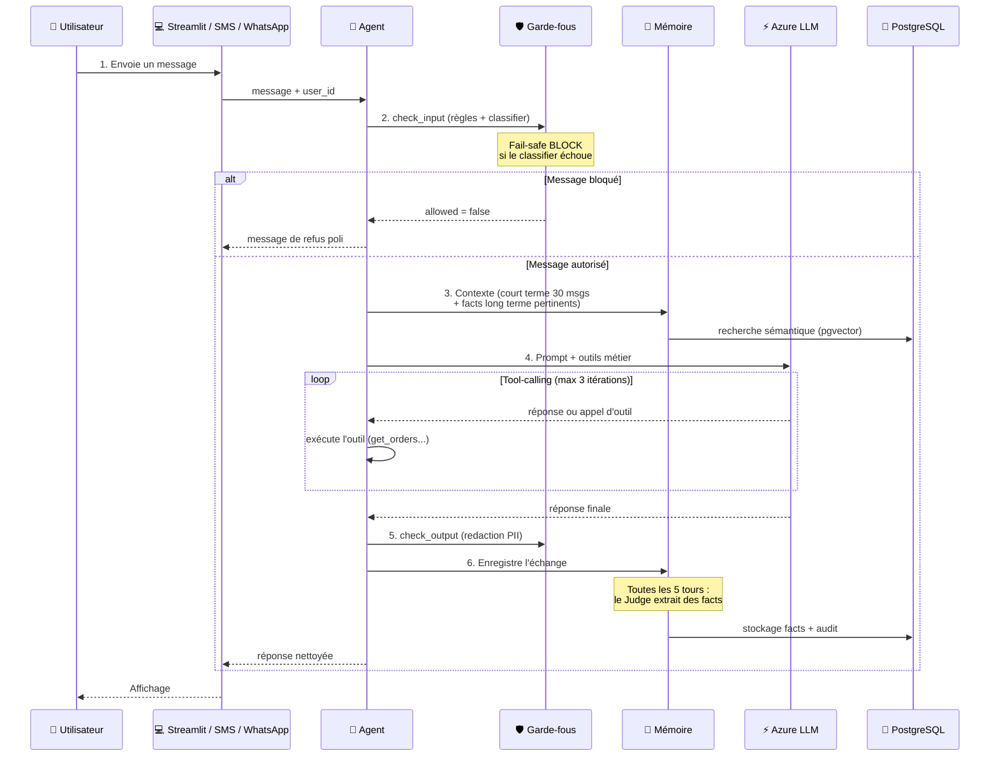

[📖 Documentation](README.md) › Architecture

# Architecture Velmo 2.0

## Vue d'ensemble

Velmo 2.0 est un agent d'assistance client IA avec **mémoire persistante**,
**garde-fous de sécurité** et **interface web**. À chaque message, le système
enchaîne trois couches : entrée sécurisée (garde-fous) → mémoire (court/long
terme) → LLM (Azure OpenAI), puis filtre la réponse avant de la renvoyer.

Ces couches correspondent aux trois chantiers du projet :

| Couche | Chantier | Doc dédiée |
|--------|----------|-----------|
| 🛡️ Garde-fous entrée/sortie | Chantier 2 | [chantiers/2-guardrails/](chantiers/2-guardrails/README.md) |
| 🧠 Mémoire court + long terme | Chantier 1 | [chantiers/1-memoire/](chantiers/1-memoire/README.md) |
| 📊 Qualité mesurée (éval + CI/CD) | Chantier 3 | [chantiers/3-qualite/](chantiers/3-qualite/README.md) |

---

## Schéma de séquence — Flux d'une interaction



---

## Structure du répertoire (essentiel)

```
Velmo2/
├── src/velmo/                  # 🎯 Package principal
│   ├── config.py              # Settings centralisés (load_settings)
│   ├── agent/                 # 🤖 Orchestration LLM + tool-calling (MAX 3 itér.)
│   ├── guardrails/            # 🛡️ Chantier 2 : classifier, règles, redaction PII, audit
│   ├── memory/                # 🧠 Chantier 1 : court terme, long terme (pgvector), judge
│   ├── business/              # 💼 E-commerce fictif + outils LangChain (get_orders...)
│   ├── channels/              # 📱 Canaux SMS (OVH) et WhatsApp (Twilio)
│   └── observability/         # 📊 Tracing LangSmith (optionnel)
├── apps/
│   ├── streamlit/             # 🌐 UI web
│   └── sms_server/            # 📨 Webhooks SMS + WhatsApp (FastAPI)
├── mlops/                     # 📊 Chantier 3 : run_eval.py + report.md + history
├── scripts/                   # 🔧 seed DB, CLI, suites d'éval (eval_*.py)
├── eval/                      # 📊 Jeux de cas (memory/guardrail/quality_cases.jsonl)
├── tests/                     # ✅ Suite pytest (140+ tests)
├── .github/workflows/         # ci.yml (auto) + quality.yml (manuel) → voir Chantier 3
└── docs/                      # 📖 Cette documentation
```

## Rôle des modules clés

| Module | Rôle |
|--------|------|
| `agent/` | Orchestration : garde-fous → mémoire → LLM → outils → garde-fous |
| `guardrails/` | Sécurité entrée (règles + classifier LLM fail-safe) et sortie (redaction PII) |
| `memory/` | Mémoire court terme (30 msgs) + long terme (pgvector) + Judge (extraction facts) |
| `business/` | Base e-commerce fictive + outils métier exposés au LLM |
| `channels/` | Points d'entrée SMS (OVH) et WhatsApp (Twilio) |
| `observability/` | Tracing LangSmith (désactivé par défaut) |
| `mlops/` | Boucle qualité : agrège les 3 suites d'éval en une note globale |

---

## Choix d'architecture importants

1. **Package unique `src/velmo/`** — layout Python standard, import propre `from velmo... import ...`.
2. **Fail-safe BLOCK** — si le classifier de sécurité échoue, on bloque par défaut (sécurité > disponibilité).
3. **Mémoire court terme = fenêtre glissante 30 messages** — borne le coût et la latence LLM.
4. **Judge toutes les 5 tours** — extraction sélective des faits durables vers la mémoire longue (contrôle du coût).
5. **Tool-calling limité à 3 itérations** — évite les boucles d'outils infinies, message de repli sinon.
6. **Mémoire longue = pgvector + embeddings** — recherche sémantique des faits (`OpenAIEmbeddings` via l'endpoint `/openai/v1`).
7. **LLM via `ChatOpenAI(base_url=.../openai/v1)`** — endpoint OpenAI-compatible d'Azure AI Foundry (PAS `AzureChatOpenAI`).
8. **Observabilité = LangSmith** (et non LangFuse) — tracing optionnel des appels LLM.

---

## Configuration

Variables d'environnement clés (voir [`.env.example`](../.env.example)) :

```env
DATABASE_URL=postgresql://...
AZURE_OPENAI_API_KEY=...
AZURE_OPENAI_ENDPOINT=https://<ressource>.services.ai.azure.com/openai/v1
AZURE_OPENAI_DEPLOYMENT_NAME=gpt-5.4-mini
CLASSIFIER_DEPLOYMENT_NAME=gpt-5.4-mini
EMBEDDING_MODEL=text-embedding-3-small
LANGSMITH_TRACING=false
```

Réglages de performance détaillés : [reference/optimisations-latence.md](reference/optimisations-latence.md).

---

**Voir aussi :** [Chantier 1 — Mémoire](chantiers/1-memoire/README.md) ·
[Chantier 2 — Garde-fous](chantiers/2-guardrails/README.md) ·
[Chantier 3 — Qualité](chantiers/3-qualite/README.md)

⬆ [Retour à l'index](README.md)
