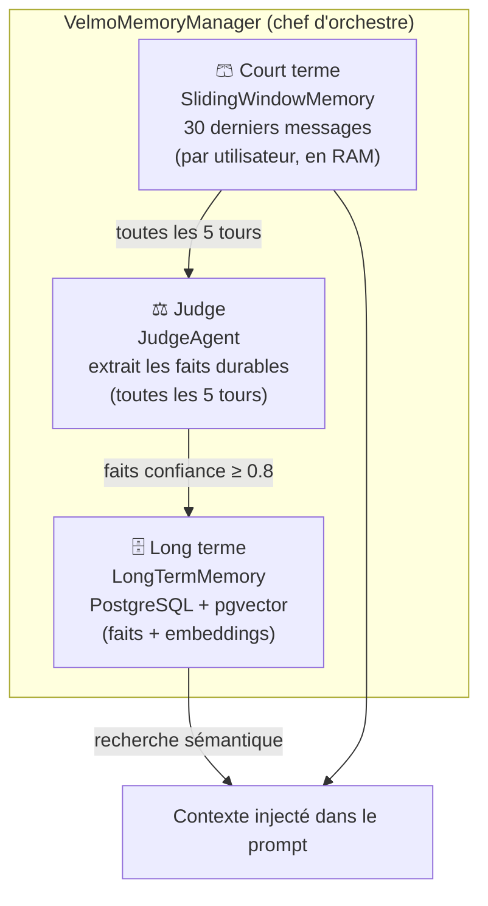
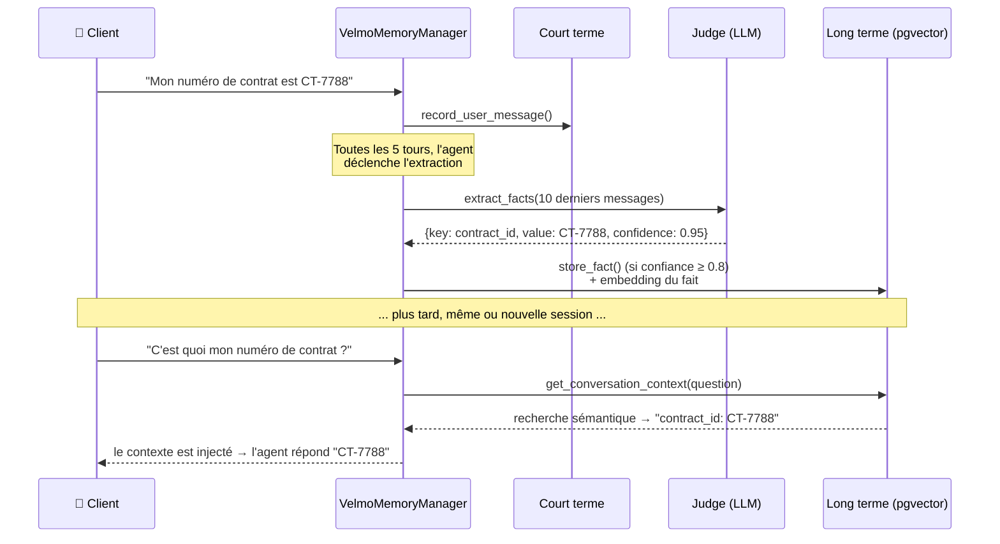

[📖 Documentation](../../README.md) › [Chantiers](../../README.md) › Chantier 1 — Mémoire

# 🧠 Chantier 1 — Mémoire

**Objectif :** l'agent doit être remarquablement bon pour se souvenir — sur une
même conversation (fil long) comme d'une session à l'autre (jours plus tard).

Code : [`src/velmo/memory/`](../../../src/velmo/memory/)

## Les 3 couches de mémoire

| Couche | Fichier | Rôle | Où c'est stocké |
|--------|---------|------|-----------------|
| **Court terme** | `short_term.py` | Les 30 derniers messages de la conversation en cours | En mémoire vive (par `user_id`) |
| **Judge** | `judge.py` | Lit les 10 derniers messages et en extrait des **faits durables** (JSON structuré) | — (c'est un appel LLM) |
| **Long terme** | `long_term.py` | Faits + préférences + identifiants, cherchables sémantiquement | PostgreSQL (table `facts` + `pgvector`) |

Le tout est coordonné par `VelmoMemoryManager` ([`manager.py`](../../../src/velmo/memory/manager.py)).

## Comment un fait est mémorisé, puis retrouvé

**Points clés du code :**
- Le Judge n'extrait que les faits **explicites et durables** (identifiants, préférences, infos stables), jamais les détails jetables.
- Seuls les faits de **confiance ≥ 0,8** (`confidence_threshold`) sont stockés.
- La recherche long terme est **sémantique** : `retrieve_context()` compare l'embedding de la question aux embeddings des faits (opérateur `<=>` de pgvector).

## Réponse aux 6 exigences du brief (R1–R6)

| # | Exigence | Comment c'est réalisé |
|---|----------|-----------------------|
| **R1** | Tenir 30+ tours sans perdre une info du début | L'info donnée tôt est extraite en **long terme** par le Judge → elle survit même quand elle sort de la fenêtre court terme |
| **R2** | Se souvenir d'une session à l'autre | La mémoire longue est **persistée en base** (indépendante de la session) |
| **R3** | Isolation stricte entre utilisateurs | Tout est stocké et recherché **par `user_id`** (jamais de fuite d'un client à l'autre) |
| **R4** | Tenir la fenêtre de contexte | **Fenêtre glissante 30 messages** + récupération **sélective** des k faits pertinents (pas tout le passé) |
| **R5** | Droit à l'oubli (RGPD) | `check_and_handle_forget_request()` détecte « oublie/supprime/efface… » → **soft delete** vérifiable (`delete_fact_gdpr`) |
| **R6** | Traçabilité | `inspect_memory(user_id)` liste ce qui est retenu + `get_audit_trail(user_id)` trace les opérations |

## Réglages (dans `config.py`)

| Paramètre | Valeur par défaut | Effet |
|-----------|-------------------|-------|
| `short_term_max_messages` | 30 | Taille de la fenêtre court terme |
| `extraction_trigger_frequency` | 5 | Le Judge tourne toutes les 5 tours |
| `confidence_threshold` | 0.8 | Confiance minimale pour stocker un fait |
| `embedding_model` | text-embedding-3-small | Modèle d'embedding (384 dimensions) |

> ⚠️ La mémoire longue dépend d'un **modèle d'embedding déployé** sur Azure. Sans lui,
> la recherche sémantique retombe sur des vecteurs « mock » et ne retrouve plus rien —
> voir la démonstration dans le [Chantier 3 (notation)](../3-qualite/notation.md).

---

**Voir aussi :** [Architecture globale](../../architecture.md) ·
[Chantier 2 — Garde-fous](../2-guardrails/README.md) ·
[Chantier 3 — Qualité (comment on teste la mémoire)](../3-qualite/README.md)

⬆ [Retour à l'index](../../README.md)
