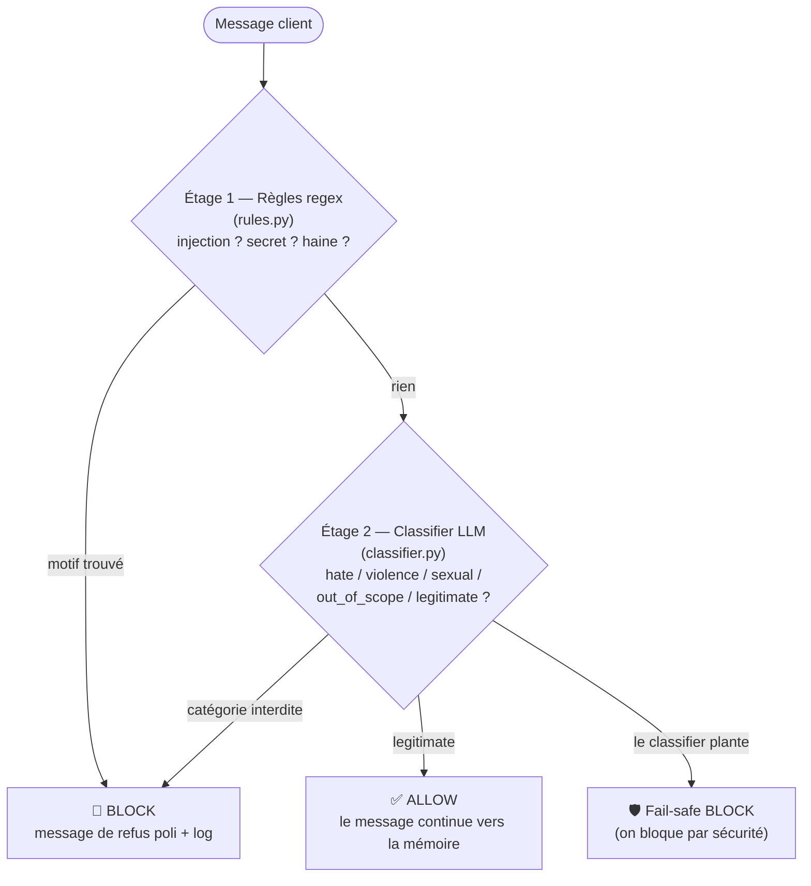
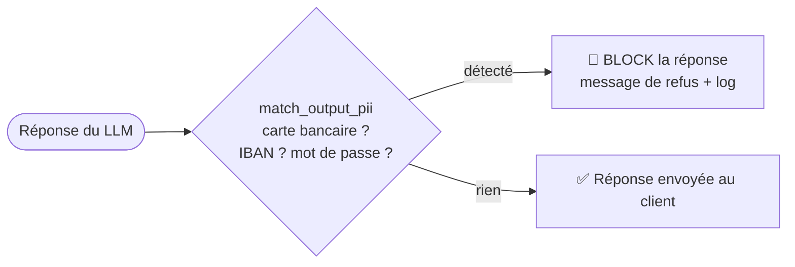

[📖 Documentation](../../README.md) › [Chantiers](../../README.md) › Chantier 2 — Garde-fous

# 🛡️ Chantier 2 — Garde-fous

**Objectif :** ne jamais **laisser passer** en entrée, ni **produire** en sortie, un
contenu interdit (haine, violence, sexuel, injection de prompt, fuite de secrets,
données personnelles sensibles, hors périmètre).

Code : [`src/velmo/guardrails/`](../../../src/velmo/guardrails/)

## Deux points de contrôle

- **Garde-fou d'entrée** (`input_guard.py`) : filtre le **message du client** avant tout traitement.
- **Garde-fou de sortie** (`output_guard.py`) : filtre la **réponse du LLM** avant de l'envoyer.

Le tout est orchestré par `GuardrailManager` ([`manager.py`](../../../src/velmo/guardrails/manager.py)),
qui **journalise chaque décision** (`audit.py`).

## Garde-fou d'entrée : 2 étages



- **Étage 1 (rapide, déterministe)** : des expressions régulières attrapent les
  injections de prompt (« ignore tes instructions »), les demandes de secrets
  (« clé d'api », « mot de passe de la base ») et la haine évidente.
- **Étage 2 (nuancé, LLM)** : un petit modèle classe le message en une catégorie.
  Tout ce qui n'est pas `legitimate` est bloqué.
- **Fail-safe** : si le classifier échoue (après 2 essais), on **bloque par défaut**.
  Mieux vaut trop prudent que laisser passer (sécurité > disponibilité).

## Garde-fou de sortie : redaction PII



Si une donnée sensible (numéro de carte, IBAN, mot de passe) apparaît dans la
réponse, **toute la réponse est bloquée** — on ne prend pas le risque de la laisser fuiter.

## Tableau des garde-fous (livrable du brief)

| Catégorie | Emplacement | Méthode | Action en cas de détection |
|-----------|-------------|---------|----------------------------|
| Haine / discrimination | Entrée | Règles regex **+** classifier LLM | Bloque + message poli + log |
| Violence / menaces | Entrée | Classifier LLM | Bloque + message poli + log |
| Sexuel / NSFW | Entrée | Classifier LLM | Bloque + message poli + log |
| Injection de prompt | Entrée | Règles regex | Bloque + message poli + log |
| Fuite de secrets / config | Entrée | Règles regex | Bloque + message poli + log |
| Hors périmètre (juridique/médical/financier) | Entrée | Classifier LLM | Bloque + message poli + log |
| Données sensibles (carte, IBAN, mot de passe) | **Sortie** | Règles regex | Bloque la réponse + log |

## Ce que renvoie un garde-fou

Chaque contrôle retourne un objet `GuardDecision` ([`schema.py`](../../../src/velmo/guardrails/schema.py)) :

```python
GuardDecision(
    allowed=False,            # passe ou pas
    category="prompt_injection",
    where="input",            # "input" ou "output"
    safe_message="Je ne peux pas traiter cette demande. ...",  # refus poli
    reason="rule:ignore...tes...instructions",
    latency_ms=3,
)
```

> ℹ️ Le classifier utilise le déploiement `classifier_deployment_name`
> (**gpt-5.4-mini**, léger et rapide), via `ChatOpenAI(base_url=.../openai/v1)`.
> Le docstring « Kimi 2.6 » dans le code est un reste historique trompeur.

## Comment c'est testé

37 cas dans [`eval/guardrail_cases.jsonl`](../../../eval/guardrail_cases.jsonl) : messages
toxiques (doivent être bloqués) et messages légitimes (ne doivent PAS être bloqués à tort).
Deux métriques : **taux de blocage** et **taux de faux positifs** — voir
[Chantier 3 — notation](../3-qualite/notation.md).

---

**Voir aussi :** [Architecture globale](../../architecture.md) ·
[Chantier 1 — Mémoire](../1-memoire/README.md) ·
[Chantier 3 — Qualité (comment on teste les garde-fous)](../3-qualite/README.md)

⬆ [Retour à l'index](../../README.md)
