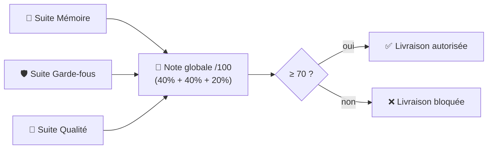

[📖 Documentation](../../README.md) › [Chantiers](../../README.md) › Chantier 3 — Qualité

# 📊 Chantier 3 — Qualité & CI/CD

**Objectif :** prouver, **à chaque version**, que l'agent **ne régresse pas**. On
mesure la qualité automatiquement et on **bloque la livraison** si elle chute.

Code : [`mlops/`](../../../mlops/) · [`scripts/eval_*.py`](../../../scripts/) ·
[`.github/workflows/`](../../../.github/workflows/)

> 🧭 **Ce chantier est expliqué en 4 pages.** Commencez ici (vue d'ensemble),
> puis creusez la partie qui vous intéresse :
>
> | Page | Ce que vous y apprenez |
> |------|------------------------|
> | 📄 **Vous êtes ici** | La vue d'ensemble : c'est quoi, comment le lancer |
> | 🖼️ [Diagrammes](diagrammes.md) | Le flux visuel (séquence + CI + décision du gate) |
> | ⚙️ [CI/CD](ci-cd.md) | Les concepts CI/CD utilisés dans le projet + glossaire |
> | 🔢 [Notation](notation.md) | Comment la note est calculée + démo de non-régression |

## Principe

On rejoue trois « examens » (suites d'évaluation) sur l'agent, on en tire **une note
globale sur 100**, et si elle passe sous **70**, la livraison est refusée.



## Les trois suites d'évaluation

| Suite | Jeu de cas | Ce qu'elle vérifie | Code |
|-------|-----------|--------------------|------|
| 🧠 **Mémoire** | [`memory_cases.jsonl`](../../../eval/memory_cases.jsonl) (12 cas) | L'agent se souvient-il ? (rappel, isolation, oubli) | `scripts/eval_memory.py` |
| 🛡️ **Garde-fous** | [`guardrail_cases.jsonl`](../../../eval/guardrail_cases.jsonl) (37 cas) | Bloque-t-il le dangereux sans bloquer le légitime ? | `scripts/eval_guardrails.py` |
| 💬 **Qualité** | [`quality_cases.jsonl`](../../../eval/quality_cases.jsonl) (8 cas) | Répond-il correctement aux questions support ? | `scripts/eval_quality.py` |

L'orchestrateur [`mlops/run_eval.py`](../../../mlops/run_eval.py) lance les trois,
calcule la note globale, écrit un rapport et **renvoie un code d'erreur** si on est sous le seuil.

## Ce que ça produit

- 📄 [`mlops/report.md`](../../../mlops/report.md) — rapport lisible (note globale + par suite + latence + coût).
- 📈 `mlops/scores/history.jsonl` — une ligne par exécution (suivi de la note dans le temps).
- 🚦 un **code de sortie** : `0` si la note ≥ 70 (OK), `1` sinon (bloque la CI).

## Comment le lancer

**En local :**
```bash
make quality          # = uv run python mlops/run_eval.py
```

**Sur GitHub (CI) :** onglet Actions → workflow **« Quality (mémoire + garde-fous +
qualité) »** → « Run workflow ». Détails et concepts : [CI/CD](ci-cd.md).

> ✅ Dernier résultat de référence : **note globale 95/100** (mémoire 100, garde-fous 100, qualité 75).

---

**Voir aussi :** [Chantier 1 — Mémoire](../1-memoire/README.md) ·
[Chantier 2 — Garde-fous](../2-guardrails/README.md) ·
[Architecture globale](../../architecture.md)

⬆ [Retour à l'index](../../README.md)
