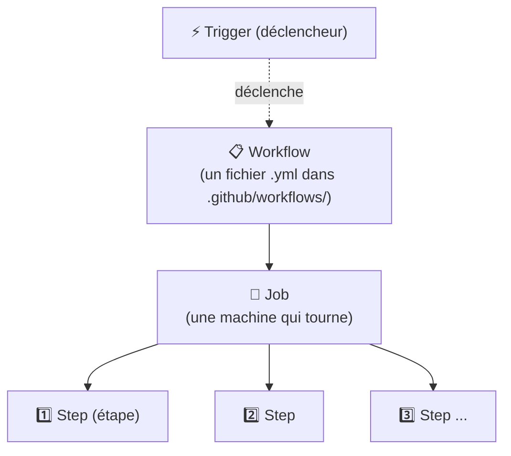

[📖 Documentation](../../README.md) › [Chantier 3](README.md) › CI/CD

# ⚙️ CI/CD — concepts et fonctionnement

Cette page présente les concepts de CI/CD utilisés dans le projet et le vocabulaire
associé. Le [glossaire](#-glossaire) en fin de page récapitule les termes.

## Définition

La **CI/CD** automatise le contrôle et la livraison du code :

- **CI (Intégration Continue)** — à chaque changement de code, des vérifications
  automatiques s'exécutent (tests, style) pour détecter les régressions tôt.
- **CD (Déploiement Continu)** — si les vérifications passent, la livraison peut
  se faire automatiquement.

Objectif : détecter les problèmes tôt et de façon automatique, sans contrôle manuel.

Ici, ce contrôle a deux niveaux :
1. `ci.yml` vérifie que **le code** est propre et que les tests passent (rapide, gratuit).
2. `quality.yml` vérifie que **l'agent IA** est toujours bon (la boucle qualité du Chantier 3).

## Les pièces de GitHub Actions

GitHub Actions est l'outil qui exécute ces contrôles. Son vocabulaire :

- **Workflow** : une recette écrite dans un fichier `.yml`. Le projet en a deux :
  `ci.yml` et `quality.yml`.
- **Trigger (déclencheur)** : ce qui lance le workflow. Deux types ici :
  - `on: push` → **automatique** à chaque envoi de code (c'est `ci.yml`).
  - `on: workflow_dispatch` → **manuel**, via un bouton « Run workflow » (c'est `quality.yml`).
- **Job** : une machine virtuelle propre (ici Ubuntu) qui exécute les étapes.
- **Step (étape)** : une commande (installer, seeder la base, lancer l'éval…).
- **Runner** : la machine fournie par GitHub qui héberge le job.

## Le « gate » : comment un contrôle bloque la livraison

Le mécanisme est simple :

> Une étape **réussit** si sa commande renvoie le **code de sortie 0**.
> Elle **échoue** si la commande renvoie **autre chose que 0** (typiquement `1`).

Notre script `run_eval.py` renvoie **`1`** quand la note est sous 70. Résultat : le
job `quality.yml` **échoue** (devient rouge), ce qui **bloque** la livraison. Quand la
note est bonne, il renvoie `0`, le job est vert, on peut livrer. Voir le
[diagramme du gate](diagrammes.md#3-décision-du-gate--le-feu-rouge-de-la-livraison).

## Les secrets

Un **secret** est une valeur sensible (clé d'API, mot de passe) qu'on ne met **jamais**
dans le code. On les range dans GitHub (**Settings → Secrets and variables → Actions**),
et le workflow les lit au moment de tourner.

Dans ce projet, toutes les clés Azure sont regroupées dans **un seul secret nommé
`VELMO2`** (le contenu du fichier `.env`). Le workflow `quality.yml` l'écrit dans un
fichier `.env` au démarrage, puis l'application lit ses clés dedans.

## Les artifacts

Un **artifact** est un fichier produit par un run, que GitHub garde et qu'on peut
**télécharger** depuis la page du run. Ici, `quality.yml` publie
[`mlops/report.md`](../../../mlops/report.md) en artifact « quality-report » : on peut
donc consulter la note de chaque exécution après coup.

## Lancer le workflow Quality (pas à pas)

1. Onglet **Actions** du dépôt GitHub.
2. Colonne de gauche : cliquez sur le nom **complet** du workflow —
   **« Quality (mémoire + garde-fous + qualité) »** (pas juste « Quality »).
3. Bouton **« Run workflow »** (à droite) → laissez la branche `main` → **Run workflow**.
4. Ouvrez le run pour suivre les étapes ; le rapport est en bas, dans **Artifacts**.

> 💡 Prérequis : le fichier `quality.yml` doit être sur la branche **par défaut**
> (`main`) pour que le bouton « Run workflow » apparaisse. Et le secret `VELMO2`
> doit exister.

## 📖 Glossaire

| Terme | Définition |
|-------|---------------|
| **CI** (Intégration Continue) | Vérifier automatiquement le code à chaque changement |
| **CD** (Déploiement Continu) | Livrer automatiquement quand les contrôles passent |
| **Workflow** | Une recette d'automatisation (`.yml`) exécutée par GitHub Actions |
| **Job** | Une machine virtuelle qui exécute une série d'étapes |
| **Step (étape)** | Une commande dans un job |
| **Trigger (déclencheur)** | Ce qui lance un workflow (`push` = auto, `workflow_dispatch` = manuel) |
| **Runner** | La machine fournie par GitHub pour exécuter le job |
| **Code de sortie** | Nombre renvoyé par une commande : `0` = succès, autre = échec |
| **Gate (portail)** | Une condition qui bloque la suite si elle n'est pas remplie |
| **Secret** | Valeur sensible stockée dans GitHub, jamais dans le code |
| **Artifact** | Fichier produit par un run, téléchargeable ensuite |
| **Branche par défaut** | La branche principale du dépôt (ici `main`) |

---

**Voir aussi :** [Diagrammes](diagrammes.md) · [Notation](notation.md) ·
[Vue d'ensemble du Chantier 3](README.md)

⬆ [Retour à l'index](../../README.md)
