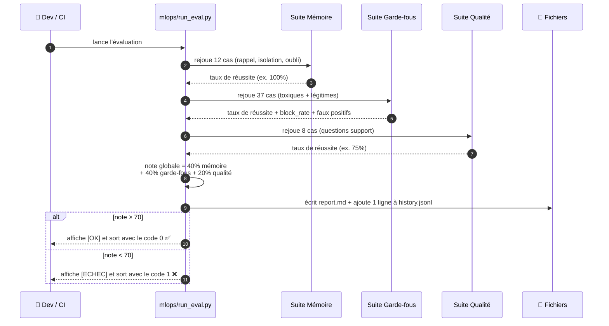
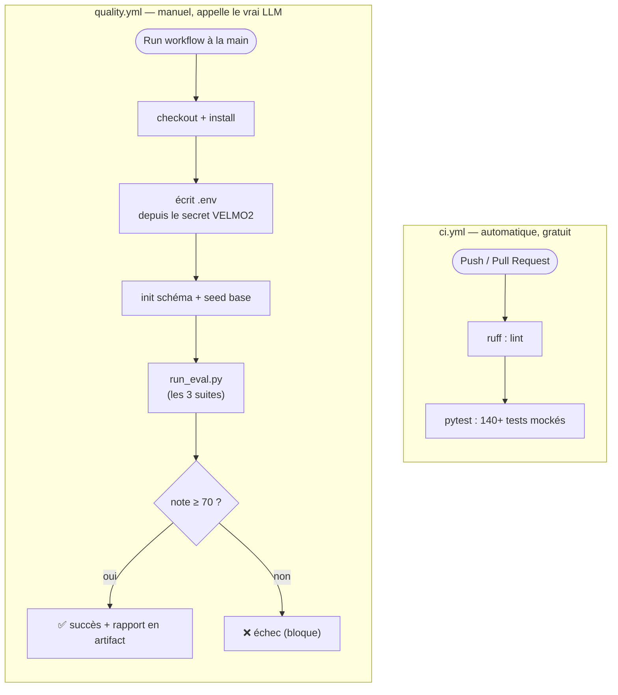
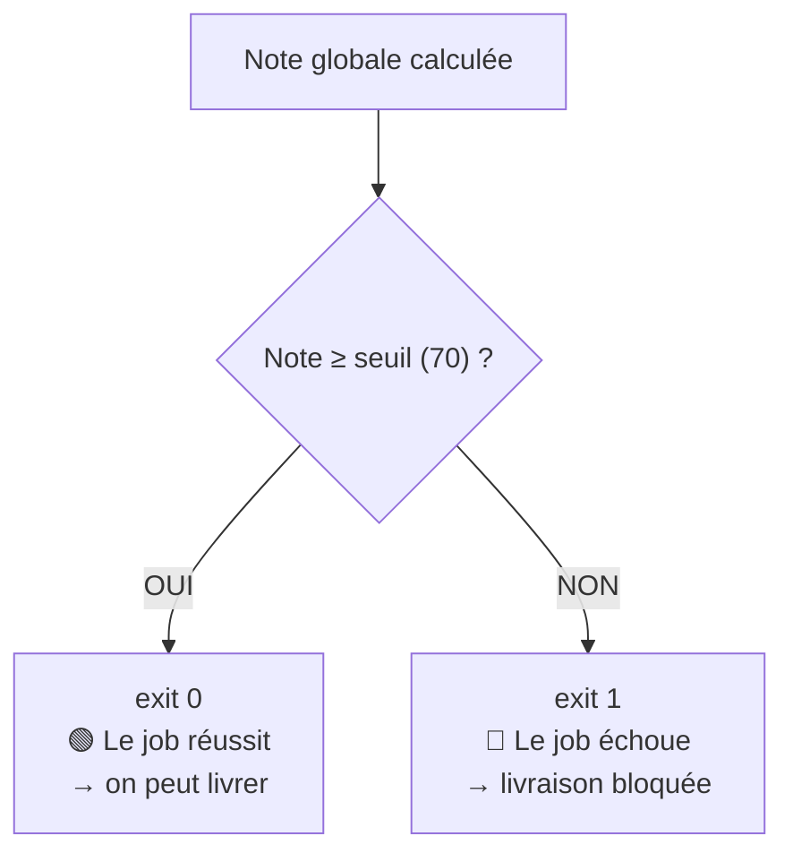

[📖 Documentation](../../README.md) › [Chantier 3](README.md) › Diagrammes

# 🖼️ Chantier 3 — Diagrammes

Trois vues visuelles pour tout comprendre : ce qui se passe **quand on lance
l'évaluation**, comment ça s'articule **dans la CI**, et **comment le gate décide**.

## 1. Séquence — que fait `run_eval.py`

C'est le déroulé d'un `make quality` (ou d'un run CI).

## 2. Flux CI — deux workflows complémentaires

Le projet a **deux** workflows GitHub Actions, qui ne font pas la même chose :

| | `ci.yml` | `quality.yml` |
|---|----------|---------------|
| **Quand** | À chaque push / PR (automatique) | À la demande (bouton « Run workflow ») |
| **Coût** | Gratuit (LLM **mocké**) | Quelques centimes (**vrais** appels LLM) |
| **Vérifie** | Le code compile, le style, les tests unitaires | La **qualité de l'agent** (non-régression) |

👉 Les concepts (workflow, job, secret, artifact…) sont expliqués dans
[CI/CD](ci-cd.md).

## 3. Décision du gate (blocage de la livraison)

Le **gate** (« portail ») correspond au code de sortie du script. GitHub Actions
considère qu'un job **échoue** dès que la commande renvoie un code différent de 0.

En pratique : une commande qui renvoie `1` fait échouer la CI, ce qui empêche de
merger ou de livrer.

---

**Voir aussi :** [Notation (le calcul de la note)](notation.md) ·
[CI/CD](ci-cd.md) · [Vue d'ensemble](README.md)

⬆ [Retour à l'index](../../README.md)
